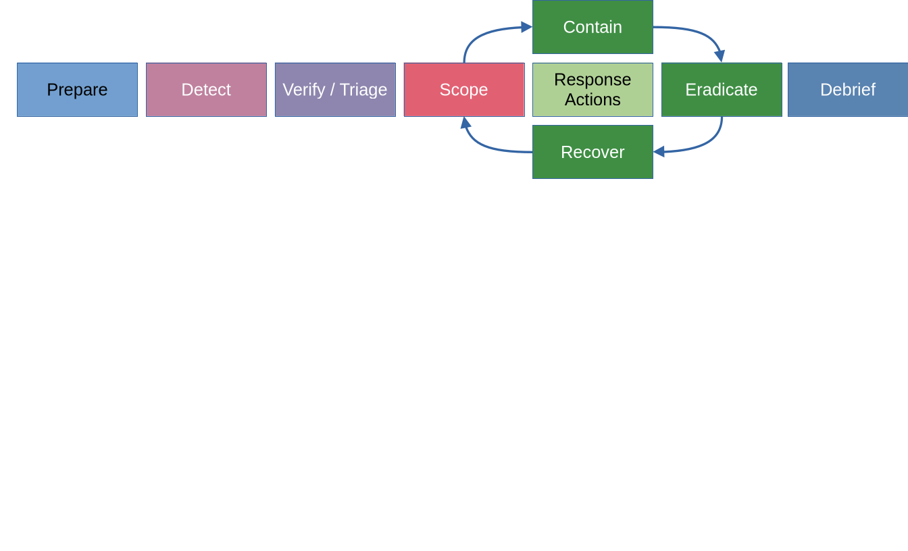

# ISC2 Cleveland Chapter May Meeting

Sponsor: TrustedSec  
Sponsor: Geöffnet Security  
Food: Rizzis  

---

# ISC2 Cleveland Chapter May Meeting

## Topic: Incident Response Exercise

**Why?**

Things change, and we need to be flexible when new information comes about.  
*Learning that Pluto is no longer a planet, may be difficult to accept the change.*  
In Business, IT, Technology, and Security, things change, information changes.
How we address or evaluate things change. 

> Mark Twain:  
"It ain't what you don't know that gets you into trouble. It's what you know for sure that just ain't so."  

---

# ISC2 Cleveland Chapter May Meeting

A significant portion of InfoSec is Risk, evaluation of **Risk.**
What are the chances something will happen, and what is will it cost us?
My first risk equation was:
```
Risk = Threat x Vulnerability
```
```
Risk = (Threat x Vulnerability) - Compensating Controls
```
---

# ISC2 Cleveland Chapter May Meeting
## Risk continued
```
Risk = Likelihood x Impact, (Probability = Likelihood)
```
```
Criticality = Probability x Severity, (Severity ≠ Impact)
```
```
Risk = Criticality (Likelihood x Vulnerability Scores [CVSS]) x Impact
```

---

# ISC2 Cleveland Chapter May Meeting
## ISC2 relation

[Risk Management Certificate](https://www.isc2.org/professional-development/certificates/risk-management)

---

# ISC2 Cleveland Chapter May Meeting
## Incident Response

My opinion:  
IR is a subset of Business Continuity and Disaster Recovery.

We are going to begin with the Incident Response Process.  

---

## Incident Response
How we as security professionals respond to cybersecurity incidents.  
What I learned previously:
```
PICERL
```
Planning or Preparation  
Identification  
Containment  
Eradication  
Recovery  
Lessons Learned  

---
## Incident Response
#### NIST SP 800-61: Computer Security Incident Handling Guide

```
PI(CER)L
```
Planning or Preparation  
Identification  
Containment, Eradication, and Recovery are a single stage.
Lessons Learned  

---

## Incident Response
### What's new?

PICERL are very linear processes and don't necessarily represent IR processes that run in tandem. This also doesn't cover repeated processes or re-work. Since these are arbitrary steps, the terminology is changing to waypoints, actions, or outcomes. 
There are now "response actions" loops.  

---
## Incident Response

---
## Incident Response

## DAIR: Dynamic Approach to Incident Response
There are now "response actions" loops.  
The loop actions continue as we learn more about the attacker's Tactics, Techniques, and Procedures (TTPs.)  
  


---

## Incident Response
## Planning and Preparation

We are here. 

---
## Incident Response
## Detect

Events of Interest (EoI) these can be alerts, notifications from wherever.  
Is this an Indicator of Attack (IoA)?  
How long was it from the event to the detection, to the determination?  
This is Mean Time To Detection (MTTD). This is one of those benchmarking terms.  
How did we do? Can we do better? How can we improve our detection capabilities?  
Another is Mean Time To Response (MTTR). How long was it from event to something was done about it?  There may also be Mean Time to Recovery (MTTR), time from start to recovered.

---
## Incident Response
## Verify, Triage

This is a new section, not previously in PICERL or NIST.  
Is it an Event of Interest, has it passed some threshold?  Is it an attack?  
Some triage, may be automated. Unwanted scans for a known vuln, may trigger automated response (containment) such as blocking IP addresses.  However, it may also be larger, more critical, with Indicators of Compromise (IoCs) and Management/leadership must be involved. Which takes us into the round-a-bout.  

---
## Incident Response
## Scope

What is involved. What ALL is involved.  ***When I started DFIR, classes, training, we focused on 1 machine, or 1 system.  My first real IR work consisted of an entire datacenter.  Figuring out everything in scope can be a daunting task, especially when people want answers and feedback "right now."  The other thing I have seen repeatedly is an incorrect scope.  Reading an Incident Report and the machines that were taken off-line were end user laptops in the US, but there were log entries and command results that indicated that there were servers inside a datacenter that were also in-scope. Nowhere in the report were servers, which to me indicated there was still an on-going issue.  

---
## Incident Response
## Scope

Those were larger scale, there may also be a single application or a library inside an application. Log4j being the most notable case, where everyone was researching if they used the library or package, what version, and did they call the vulnerable functions? This was the drive towards Software Bill of Materials (SBoM). Again, there were a large number of mistakes made, reporting early, as this was a new task for many vendors and companies.  

To me, this is apropos for starting the loop, or round-a-bout. The scope often changes (grows) and you are in ground hog day.  

---
## Incident Response
## Contain

Stop the bleeding. This is a major milestone and isn't easy. IT by nature starts fixing the issue. Management wants to know risk to make a decision. Do we need forensic evidence that hasn't been changed? Technology has made much of this easier, however, without Playbooks, or Procedures critical data may be lost.  
As an example, IT starts fixing the issue, freeing up disk space by deleting files, killing processes, shutting systems down, or rebooting. Snapshots can be made of virtual systems, but quite often memory is not included by default in snapshots. Without an accurate scope, containment can become whack-a-mole, iterating through systems in-scope.

---
## Incident Response
## Eradicate

Undo the attackers actions. Removing software, processes, accounts. Restoring from known good backups. Redeploying from known good source. Removing fraudulent transactions. Patching or removing the vulnerability that allowed exploitation.  
The more you research to ensure the attackers presence has been fully eradicated is when scope may increase and another loop iteration begins.  

---
## Incident Response
## Recover  

Bring systems back on-line, Ensure that the root cause has been remediated.  Any additional compensating controls have been implemented, and additional monitoring of the assets in-scope is functional. 

---
## Incident Response
## Repeat as needed.

---
## Incident Response
## Debrief  

Each time around the loop add to the stack of items that were covered. Note what went well, what could be improved, and any blockers that occurred.  
This may be the after-action report, it is an artifact that documents the incident and related details. Executive reports, stakeholder notifications, regulatory reporting, public disclosures, will derive from this artifact.  

Lessons Learned is the scheduled meeting to review, what changes were implemented, how things went, and what has been implemented to prevent future occurrences. This is where SLA's, Mean Time stats are analyzed, and performance analysis of the IR are reviewed.  

---