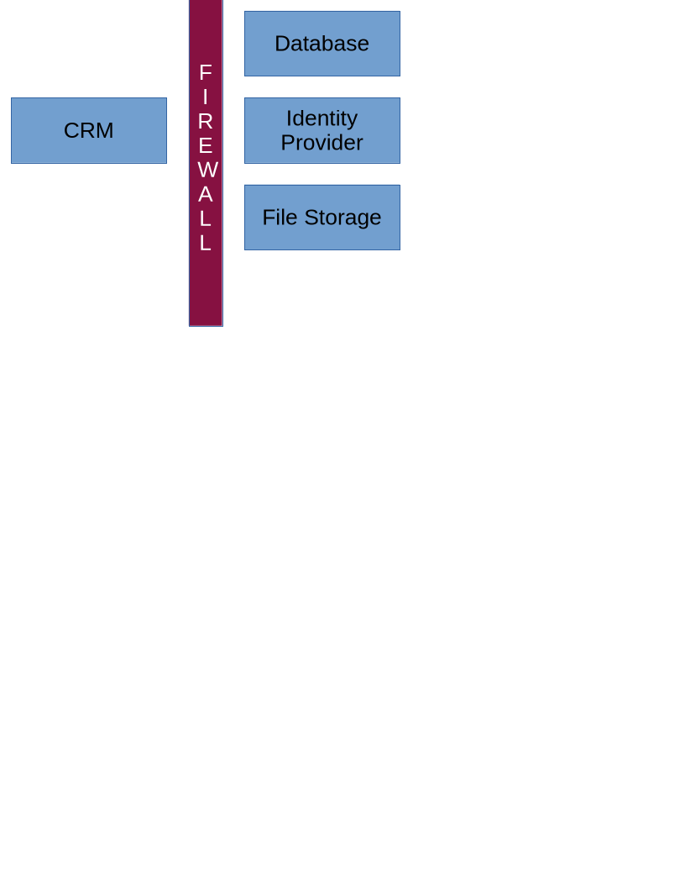
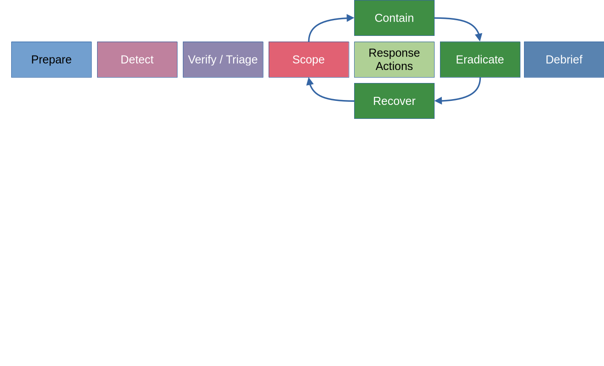

# ISC2 Cleveland Chapter IR Exercise

This is a fictitious incident used as an exercise.  

---
# ISC2 Cleveland Chapter IR Exercise
## Background

The ISC2 Cleveland Chapter runs a massive operation behind the scenes.
We have developed our own Customer Relationship Management (CRM) to manage all of our customer interactions and compiles data from a range of different communication channels, including our websites, phones, email, live chats, marketing materials and all of our social media. It's a huge resource for our super competitive Chapter sales team.  

---
# ISC2 Cleveland Chapter IR Exercise



---
# ISC2 Cleveland Chapter IR Exercise
## Weird Stuff

There is a new port/service showing up on port 4444 of our CRM.

---

# ISC2 Cleveland Chapter IR Exercise

```
Sysadmin finds stuff, shuts it off, reports back that the issue has been fixed.
```
---
# ISC2 Cleveland Chapter IR Exercise
## What should have happened?



---

Events:
Network scans. Where did the traffic come from?  
Threat Intel:
Are there known groups that use the IPs, or VPNs for their scans?  

Scanning, probing the CRM web app.  
Attack:
Exploitation of the CRM web app, to pivot to the internal network.  
Lateral movement from the CRM to the back end systems.  
Weak passwords, re-used passwords, passwords in scripts.  
Internal monitoring and alerts.  
Addition of the service on the server was probably a persistance connection.  
Didn't catch things on the firewall.  
Didn't scan any other systems for IoCs.  

---